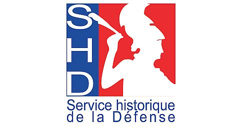

#  projet_ardouin 

## L'organisation du dépot 

**tables numérisées/1701-1705**  --> les pages numérisées du 2ème tome de tables ardouin, qui traite de la correspondence de 1701-1705

**xl2sql** --> le traitement en `python` avec `pandas` et `sqlite3` des fiches excel (personnes, bateaux et affaires) du 2ème tome des tables ardouin pour les transformer en base de données relationnelles lisible par libre office base (format .db)

**Ardouin La Totale.xls** --> l'intégralité des tables ardouin transcrites en excel 

**xml_original** --> les fiches originales en xml ead qui sont utilisées sur le site du SHD

## Description 
Dans le cadre de mon stage de master d'humanités numériques, je participe à un travail de harmonisation, de fluidification et de remaniement du projet des [tables ardouin](https://www.servicehistorique.sga.defense.gouv.fr/ressources/les-tables-ardouin) porté par le SHD de Rochefort.  

Les tables ardouin sont un index fait par le docteur Ardouin, un ancien officier de Marine devenu archiviste pour le Service historique de la Marine au début du 20ème siecle. Les index manuscrits qu'il a écrit référencent des noms de personnes, des noms de bateaux et diverse noms propres qui varient des lieux jusqu'aux événements. Ces references font appel aux côtes des archives de la correspondance entre le ministère de la marine et l'intendance de l'arsenal de Rochefort aux 17ème et 18ème siècles.

## Attentes
J'espère pouvoir effectuer ces améliorations ou au moins établir une méthodologie pour y arriver : 
- transformation d'excel en base de données `sqlite` qui pourrait être lu par libre office base
- encodage de cette base en `xml ead` 
- faire le lien entre l'entrée de l'index et le microfilm numérisé
- essayer de lématiser et normaliser les entrées afin de favoriser des requêtes profondes et efficaces 